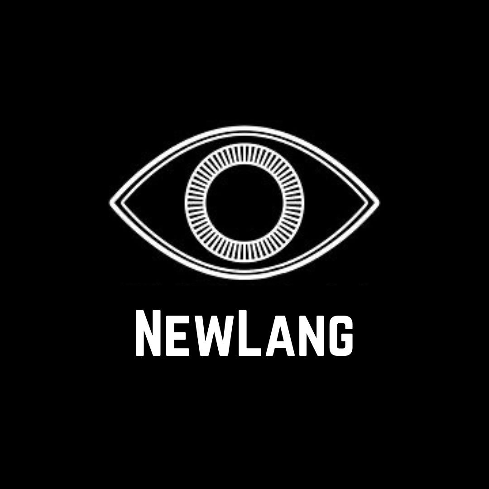

# NewLang

**Introducing NewLang: A Language Based on George Orwell's 1984**

In the year 2025, the programming domain has become a playground of division and ambiguity. With so many choices—C, Java, JavaScript—how can we decide which one to master? This confusion stems from too much freedom, too much individuality. But now, a new language emerges to solve this problem: **NewLang**.

Inspired by Newspeak from Orwell's *1984*, NewLang strips away all that is unnecessary, leaving only what is **needed**, **clear**, and **enforceable**. There is no superfluous code—only **direct**, **optimized execution**. There are no verbose errors—only **"ungood state"**. In this world, there is no room for inefficiency or ambiguity. **NewLang** ensures that every programmer writes only what is **plusgood**, adhering to the Party-approved standards of clarity and precision.

Designed for a future where code is **loyal, compact**, and **unbreakable**, NewLang offers a programming experience like no other: one where **simplicity is strength**, and **verbosity is weakness**. In **NewLang**, there is no space for thoughtcrime. Every line of code reflects the ultimate truth, the ultimate purpose.

Welcome to **the future of programming**—a future free of choice, free of excess, where **every line is truth**. A new world. An Ultimate world.

## Language Overview:

### Features:

-  Everything is immutable to promote communication within the Party
-  Everything is direct, and verbosity is minimized/highly specified keywords to ensure efficiency
-  All variable states are fixed
-  No reassignment
-  Use of recursion over loops to maintain the immutable and direct nature of the language
  
#### Types

- Num: newnum
- Text: newtext
- List: newlist
- Bool: newbool
- Dict: newdict
- Set: newset
- Function: newfunction

#### Operators
- Add: `plus`
- Subtract: `minus`
- Multiply: `multiply`
- Divide: `divide`
- Modulo: `remain`
- Less than or equal: `lessis`
- Less than: `less`
- Greater than or equal: `moreis`
- Greater than: `more`
- Equal: `is`
- Not equal: `unis`
- Logical AND: `and`
- Logical OR: `or`
- Define Immutable Function: 'newfunction'
- Return: 'confess'
- Else If: 'elif'

### Comments:

<table>
<tr> <th>NewLang</th><th>JavaScript</th> </tr>
<tr>
<td>

<code>#WarIsPeace</code>

</td>
<td>

<code>//War Is Peace</code>

</td>
</tr> </table>

## Example Programs:

### Hello World

<table>
<tr> <th>NewLang</th><th>JavaScript</th> </tr>
<tr>
<td>

<code>speak("BIG BROTHER IS WATCHING")</code>

</td>
<td>

<code>console.log("Hello, World!")</code>

</td>
</tr> </table>

### Variable Declaration

<table>
<tr> <th>NewLang</th><th>JavaScript</th> </tr>
<tr>
<td>

<code>newtext x is "Ignorance is strength"</code>

</td>
<td>

<code>const x = "Ignorance is strength"</code>

</td>
</tr> </table>

### Assignment Statement

<table>
<tr> <th>NewLang</th><th>JavaScript</th> </tr>
<tr>
<td>

<code>#REASSIGNMENT IS CRIMETHOUGHT</code>

</td>
<td>

<code>x = y</code>

</td>
</tr> </table>

### Functions

<table>
<tr> <th>NewLang</th><th>JavaScript</th> </tr>
<tr>
<td>
<code>newfunction goodplus (x, y){
    confess x plus y
}
</code>

</td>
<td>
<code>function add (x, y) {
    return x + y;
}
</code>
</td>
</tr> </table>

### Loops

<table>
<tr> <th>NewLang</th><th>JavaScript</th> </tr>
<tr>
<td>
<code>newfunction speakloop (i, end){
    if i is end {
        confess
    } else {
        speak("BIG BROTHER")
        confess speakloop(i plus 1, end)
    }
}
</code>
</td>
<td>
<code>for(let i = 1; i < 2; i++){
    console.log("Hello")
}
</code>
</td>
</tr> </table>

### Conditionals

<table>
<tr> <th>NewLang</th><th>JavaScript</th> </tr>
<tr>
<td>
<code>if thought is untruth {
    speak("Miniluv")
} elif thought is truth {
    speak("Minitrue")
}
</code>
</td>
<td>
<code>if(!thought) {
    console.log("Ministry of Love")
} 
else if(thought){
    console.log("Ministry of Truth")
}
</code>
</td>
</tr> </table>
